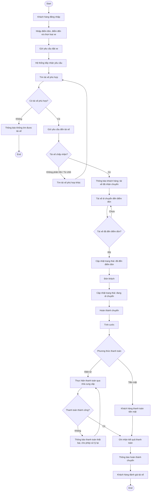
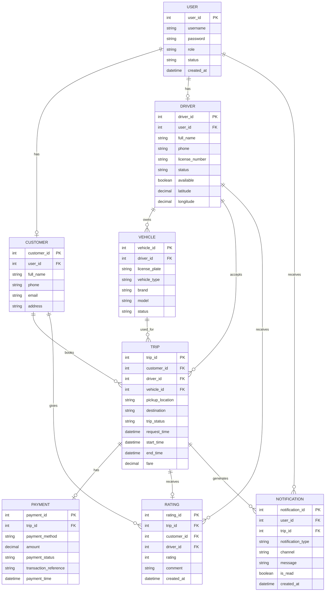
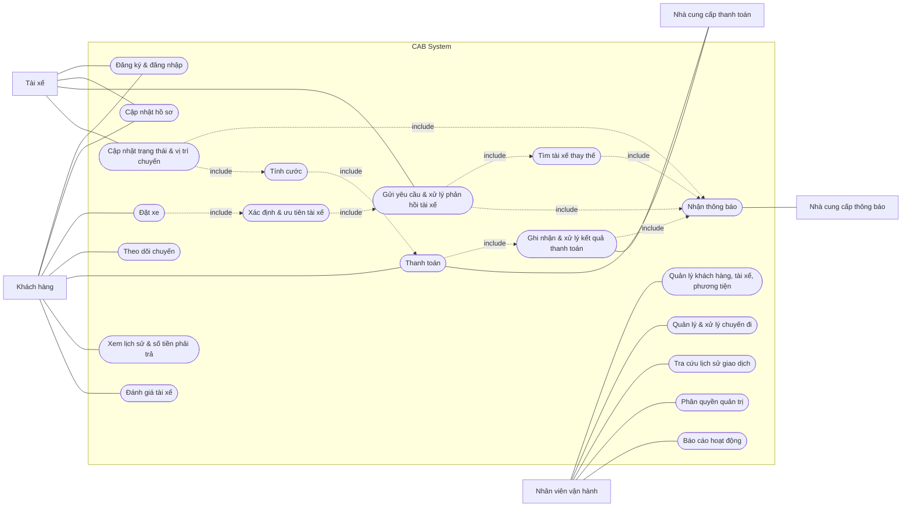

# 1. Stakeholders

| Stakeholder                         | Vai trò                                                                                                                                                                          |
| ----------------------------------- | -------------------------------------------------------------------------------------------------------------------------------------------------------------------------------- |
| **Ban lãnh đạo Công ty ABC**        | Định hướng mục tiêu kinh doanh, đưa ra kỳ vọng đối với hệ thống và theo dõi các chỉ số hoạt động như số lượng chuyến, doanh thu, tỷ lệ hoàn thành, tỷ lệ hủy và hiệu quả tài xế. |
| **Khách hàng**                      | Đăng ký tài khoản, đặt xe, theo dõi chuyến đi, xem lịch sử, thanh toán và đánh giá tài xế.                                                                                       |
| **Tài xế**                          | Đăng ký hoặc được vận hành tạo tài khoản, quản lý hồ sơ và phương tiện, nhận/từ chối chuyến, cập nhật trạng thái chuyến và vị trí.                                               |
| **Nhân viên vận hành**              | Quản lý khách hàng, tài xế, phương tiện, chuyến đi; theo dõi chuyến đang diễn ra; xử lý các chuyến bị lỗi và tra cứu lịch sử giao dịch.                                          |
| **Nhà cung cấp dịch vụ thanh toán** | Xử lý thanh toán điện tử cho hệ thống; CAB System không lưu trực tiếp thông tin nhạy cảm của thẻ hoặc tài khoản thanh toán.                                                      |
| **Nhà cung cấp dịch vụ thông báo**  | Cung cấp các kênh gửi thông báo đến khách hàng và tài xế, đồng thời hỗ trợ mở rộng thêm kênh thông báo trong tương lai.                                                          |

# 2. Stakeholder Matrix

| Stakeholder                         | Mức độ quan tâm | Mức độ ảnh hưởng | Chiến lược quản lý                                             |
| ----------------------------------- | --------------- | ---------------- | -------------------------------------------------------------- |
| **Ban lãnh đạo Công ty ABC**        | Cao             | Cao              | Quản lý chặt chẽ, báo cáo định kỳ về hiệu quả hệ thống         |
| **Khách hàng**                      | Cao             | Cao              | Thu thập phản hồi và đảm bảo trải nghiệm sử dụng               |
| **Tài xế**                          | Cao             | Cao              | Hỗ trợ thường xuyên và đảm bảo quy trình nhận chuyến hiệu quả  |
| **Nhân viên vận hành**              | Cao             | Cao              | Phối hợp chặt chẽ và cung cấp đầy đủ công cụ quản lý           |
| **Nhà cung cấp dịch vụ thanh toán** | Trung bình      | Cao              | Theo dõi tích hợp và xử lý kịp thời các sự cố thanh toán       |
| **Nhà cung cấp dịch vụ thông báo**  | Trung bình      | Trung bình       | Theo dõi chất lượng dịch vụ và khả năng mở rộng kênh thông báo |

# 3. Business Goals (Mục tiêu Kinh doanh)

| ID       | Business Goal                                   | Mô tả                                                                        |
| -------- | ----------------------------------------------- | ---------------------------------------------------------------------------- |
| **BG01** | Xây dựng nền tảng đặt xe trực tuyến             | Cung cấp nền tảng giúp khách hàng đặt xe và theo dõi chuyến đi thuận tiện.   |
| **BG02** | Tự động hóa việc tìm và phân công tài xế        | Tự động tìm tài xế phù hợp dựa trên vị trí, trạng thái và tiêu chí vận hành. |
| **BG03** | Nâng cao trải nghiệm khách hàng                 | Cung cấp quy trình đặt xe, theo dõi, thanh toán và đánh giá thuận tiện.      |
| **BG04** | Nâng cao hiệu quả quản lý vận hành              | Tập trung quản lý khách hàng, tài xế, phương tiện và các chuyến đi.          |
| **BG05** | Quản lý thanh toán và doanh thu                 | Hỗ trợ tính cước, thanh toán và theo dõi lịch sử giao dịch.                  |
| **BG06** | Đảm bảo hệ thống ổn định và có khả năng mở rộng | Đảm bảo hệ thống hoạt động ổn định khi tải tăng và dễ dàng mở rộng.          |
| **BG07** | Đảm bảo an toàn và bảo mật dữ liệu              | Bảo vệ thông tin cá nhân, vị trí, giao dịch và kiểm soát quyền tr            |

# 4. Minimum Viable Product (MVP) Modules

| Module                             | Mô tả                                  | Chức năng chính                                         |
| ---------------------------------- | -------------------------------------- | ------------------------------------------------------- |
| **User & Driver Management**       | Quản lý thông tin khách hàng và tài xế | Đăng ký, đăng nhập, cập nhật hồ sơ, quản lý trạng thái  |
| **Booking Management**             | Quản lý yêu cầu đặt xe                 | Tạo, tiếp nhận và theo dõi yêu cầu đặt xe               |
| **Driver Matching & Dispatch**     | Tìm và phân công tài xế                | Tìm tài xế phù hợp, gửi yêu cầu và xử lý phản hồi       |
| **Trip Management**                | Quản lý quá trình thực hiện chuyến     | Cập nhật trạng thái, vị trí và kết thúc chuyến          |
| **Fare & Payment**                 | Tính cước và thanh toán                | Tính tiền, thanh toán tiền mặt hoặc điện tử             |
| **Notification**                   | Gửi thông báo                          | Thông báo đặt xe, nhận chuyến, trạng thái và thanh toán |
| **History & Rating**               | Quản lý lịch sử và đánh giá            | Xem lịch sử chuyến, số tiền và đánh giá tài xế          |
| **Operation Management**           | Quản lý hoạt động vận hành             | Quản lý khách hàng, tài xế, phương tiện và chuyến đi    |
| **Reporting**                      | Báo cáo hoạt động                      | Thống kê chuyến đi, doanh thu và hiệu quả tài xế        |
| **Authentication & Authorization** | Xác thực và phân quyền                 | Kiểm soát đăng nhập và quyền truy cập chức năng         |

# 4. MVP Modules

| STT | Module | Mô tả | Chức năng chính |
|---|---|---|---|
| 1 | **Quản lý tài khoản & xác thực** | Quản lý tài khoản và xác thực người dùng. | Đăng ký, đăng nhập, cập nhật thông tin cá nhân. |
| 2 | **Quản lý tài xế & phương tiện** | Quản lý hồ sơ tài xế, phương tiện và trạng thái hoạt động. | Đăng ký/tạo tài khoản tài xế, cập nhật hồ sơ và phương tiện, cập nhật trạng thái sẵn sàng nhận chuyến. |
| 3 | **Đặt xe** | Cho phép khách hàng tạo yêu cầu đặt xe. | Nhập điểm đón/điểm đến, chọn loại xe, gửi yêu cầu đặt xe. |
| 4 | **Tìm kiếm & phân công tài xế** | Tự động tìm tài xế phù hợp với yêu cầu của khách hàng. | Xác định tài xế theo vị trí, trạng thái sẵn sàng và tiêu chí vận hành; ưu tiên tài xế phù hợp và gần khách hàng; tìm tài xế khác khi bị từ chối hoặc không phản hồi. |
| 5 | **Quản lý chuyến đi** | Quản lý toàn bộ trạng thái chuyến từ lúc đặt đến khi hoàn thành. | Cập nhật trạng thái chuyến, cập nhật vị trí tài xế, theo dõi chuyến, hiển thị thông tin tài xế và thời gian dự kiến đến. |
| 6 | **Tính cước & thanh toán** | Tính số tiền khách hàng phải trả và xử lý thanh toán. | Tính cước, thanh toán tiền mặt, thanh toán điện tử, ghi nhận kết quả giao dịch, xử lý thanh toán thất bại. |
| 7 | **Thông báo** | Gửi thông tin cập nhật đến khách hàng và tài xế. | Thông báo các sự kiện của chuyến đi (tiếp nhận yêu cầu, tài xế nhận chuyến, đến điểm đón, hoàn thành, kết quả thanh toán) và chuyến mới/thay đổi cho tài xế. |
| 8 | **Lịch sử & đánh giá** | Cho phép khách hàng xem lại thông tin chuyến và đánh giá tài xế. | Xem lịch sử chuyến, xem số tiền phải trả, đánh giá tài xế sau khi hoàn thành chuyến. |
| 9 | **Quản lý vận hành** | Hỗ trợ nhân viên vận hành theo dõi và quản lý hoạt động hệ thống. | Quản lý khách hàng, tài xế, phương tiện, chuyến đi; xem chuyến đang diễn ra; kiểm tra trạng thái tài xế; xử lý chuyến bị lỗi; tra cứu lịch sử giao dịch; phân quyền quản trị. |
| 10 | **Báo cáo cơ bản** | Cung cấp dữ liệu phục vụ theo dõi hoạt động kinh doanh. | Báo cáo số lượng chuyến, doanh thu, tỷ lệ hoàn thành, tỷ lệ hủy và hiệu quả hoạt động của tài xế. |

---

# 5. Business Requirements

| ID | Business Requirement | Mô tả |
|---|---|---|
| BR01 | Xây dựng nền tảng đặt xe trực tuyến | Thay thế hệ thống hiện tại, cho phép khách hàng và tài xế thực hiện toàn bộ quy trình đặt và thực hiện chuyến trên cùng một nền tảng. |
| BR02 | Hỗ trợ số lượng lớn người dùng | Phục vụ số lượng lớn khách hàng và tài xế, có khả năng mở rộng khi nhu cầu sử dụng tăng. |
| BR03 | Tự động hóa việc tìm và phân công tài xế | Tự động tìm và ưu tiên tài xế phù hợp dựa trên vị trí, trạng thái sẵn sàng và tiêu chí vận hành; tiếp tục tìm tài xế khác khi tài xế không phản hồi hoặc từ chối chuyến. |
| BR04 | Quản lý toàn bộ quy trình chuyến xe | Theo dõi toàn bộ quy trình từ khi khách hàng tạo yêu cầu đến khi chuyến hoàn thành và được đánh giá. |
| BR05 | Cung cấp khả năng theo dõi chuyến đi | Cho phép khách hàng theo dõi trạng thái chuyến, thông tin tài xế, thời gian dự kiến đến, lịch sử chuyến và số tiền phải trả. |
| BR06 | Hỗ trợ tính cước và thanh toán | Tính số tiền khách hàng phải trả; hỗ trợ thanh toán tiền mặt và điện tử qua nhà cung cấp bên ngoài, không lưu trực tiếp thông tin thanh toán nhạy cảm. |
| BR07 | Quản lý thông báo | Thông báo cho khách hàng và tài xế về các sự kiện quan trọng trong quá trình đặt, thực hiện chuyến và kết quả thanh toán. |
| BR08 | Hỗ trợ quản lý và vận hành tập trung | Cung cấp giao diện quản trị để nhân viên vận hành quản lý khách hàng, tài xế, phương tiện, chuyến đi và xử lý các trường hợp bất thường. |
| BR09 | Cung cấp báo cáo hoạt động | Cung cấp dữ liệu và báo cáo về số lượng chuyến, doanh thu, tỷ lệ hoàn thành, tỷ lệ hủy và hiệu quả hoạt động của tài xế. |
| BR10 | Đảm bảo tính ổn định và khả năng mở rộng | Hoạt động ổn định khi nhu cầu tăng cao; các thành phần mở rộng độc lập; lỗi tại một thành phần (thanh toán/thông báo) không làm dừng toàn bộ hệ thống. |
| BR11 | Đảm bảo an toàn và bảo mật dữ liệu | Xác thực người dùng, kiểm soát quyền truy cập với chức năng quản trị, bảo vệ dữ liệu cá nhân/vị trí/giao dịch, lưu vết các thao tác quan trọng. |
| BR12 | Hỗ trợ phát triển và mở rộng trong tương lai | Kiến trúc linh hoạt để bổ sung loại dịch vụ, phương thức thanh toán, nhà cung cấp thông báo hoặc thay đổi thành phần kỹ thuật mà không phải xây lại toàn bộ hệ thống. |

**Liên kết Business Goals ↔ Business Requirements**

| BG | BR liên quan |
|---|---|
| BG1 | BR01, BR02, BR12 |
| BG2 | BR03 |
| BG3 | BR04, BR05, BR07 |
| BG4 | BR08 |
| BG5 | BR06 |
| BG6 | BR10, BR11 |
| BG7 | BR09 |

---

# 6. Business Process Modeling

## 6.1. Business Process Overview

Quy trình nghiệp vụ cốt lõi của hệ thống CAB — vòng đời một chuyến xe — gồm các bước:

**Tạo yêu cầu đặt xe → Tìm kiếm và phân công tài xế → Xác nhận chuyến → Thực hiện chuyến → Tính cước → Thanh toán → Hoàn tất chuyến → Đánh giá**

Đây là quy trình duy nhất được mô hình hóa chi tiết vì đây là quy trình trung tâm, xuyên suốt các module của hệ thống. Các nhóm chức năng còn lại (quản lý tài khoản, quản lý vận hành, báo cáo) là các chức năng hỗ trợ, không phải quy trình tuần tự nhiều bước.

## 6.2. Business Process Diagram

## 6.3. Các bên tham gia trong Business Process

| Actor / Stakeholder | Vai trò trong quy trình |
|---|---|
| **Khách hàng** | Tạo yêu cầu đặt xe, theo dõi chuyến, thanh toán, đánh giá tài xế. |
| **Hệ thống CAB** | Tiếp nhận yêu cầu, tìm và phân công tài xế, quản lý trạng thái chuyến, tính cước, xử lý thanh toán, gửi thông báo. |
| **Tài xế** | Nhận/từ chối chuyến, di chuyển đến điểm đón, đón khách, cập nhật trạng thái, hoàn thành chuyến. |
| **Nhà cung cấp thanh toán** | Xử lý giao dịch thanh toán điện tử, trả về kết quả giao dịch. |
| **Nhân viên vận hành** | Theo dõi chuyến đang diễn ra, kiểm tra trạng thái tài xế, hỗ trợ xử lý chuyến bị lỗi (nằm ngoài luồng chính, can thiệp khi có sự cố). |

## 6.4. Business Process theo Business Requirement

| Business Requirement | Bước quy trình liên quan |
|---|---|
| BR01 – Nền tảng đặt xe trực tuyến | Toàn bộ quy trình đặt và thực hiện chuyến |
| BR03 – Tự động hóa tìm và phân công tài xế | Tìm tài xế → Kiểm tra phản hồi → Tìm tài xế khác khi cần |
| BR04 – Quản lý toàn bộ quy trình chuyến xe | Từ tạo yêu cầu đến hoàn thành chuyến |
| BR05 – Theo dõi chuyến đi | Cập nhật và thông báo trạng thái chuyến |
| BR06 – Tính cước và thanh toán | Tính cước → Thanh toán → Xử lý kết quả giao dịch |
| BR07 – Quản lý thông báo | Thông báo xuyên suốt các bước của quy trình |
| BR11 – Bảo mật dữ liệu | Đăng nhập/xác thực trước khi khách hàng tạo yêu cầu |

---

# 7. Functional Requirements

> Đã rà soát và gộp các chức năng nhỏ lẻ, liên quan chặt chẽ với nhau vào cùng một FR (ví dụ: các bước nhập liệu/gửi yêu cầu trong cùng một thao tác nghiệp vụ, các thao tác CRUD cùng nhóm đối tượng của nhân viên vận hành) để giữ lại **19 yêu cầu chức năng cốt lõi**, phản ánh đúng và đủ nghiệp vụ trong đề bài mà không rời rạc hóa quá mức.

| ID | Module | Functional Requirement | Mô tả |
|---|---|---|---|
| FR01 | Quản lý tài khoản & xác thực | Đăng ký & đăng nhập | Hệ thống cho phép khách hàng đăng ký tài khoản, tài xế tự đăng ký hoặc được nhân viên vận hành tạo tài khoản; khách hàng và tài xế đăng nhập trước khi sử dụng chức năng yêu cầu tài khoản. |
| FR02 | Quản lý tài khoản & xác thực | Cập nhật hồ sơ | Hệ thống cho phép khách hàng cập nhật thông tin cá nhân; tài xế cập nhật hồ sơ, thông tin phương tiện và trạng thái sẵn sàng nhận chuyến. |
| FR03 | Đặt xe | Tạo yêu cầu đặt xe | Hệ thống cho phép khách hàng nhập điểm đón, điểm đến, chọn loại xe và gửi yêu cầu đặt xe; hệ thống tiếp nhận và ghi nhận yêu cầu. |
| FR04 | Tìm kiếm & phân công tài xế | Xác định & ưu tiên tài xế phù hợp | Hệ thống xác định các tài xế phù hợp dựa trên vị trí, trạng thái sẵn sàng và tiêu chí vận hành, đồng thời ưu tiên tài xế phù hợp và gần khách hàng. |
| FR05 | Tìm kiếm & phân công tài xế | Gửi yêu cầu & xử lý phản hồi tài xế | Hệ thống gửi yêu cầu chuyến đến tài xế phù hợp và ghi nhận việc tài xế chấp nhận hoặc từ chối. |
| FR06 | Tìm kiếm & phân công tài xế | Tìm tài xế thay thế | Khi tài xế không phản hồi hoặc từ chối, hệ thống tự động tìm tài xế khác mà không yêu cầu khách hàng tạo lại yêu cầu; nếu không còn tài xế phù hợp, hệ thống thông báo rõ ràng cho khách hàng. |
| FR07 | Quản lý chuyến đi | Cập nhật trạng thái & vị trí chuyến | Hệ thống cho phép tài xế cập nhật trạng thái chuyến (đã đến điểm đón, đã đón khách, đang di chuyển, hoàn thành) và cập nhật vị trí trong suốt quá trình thực hiện chuyến. |
| FR08 | Quản lý chuyến đi | Theo dõi chuyến | Hệ thống cho phép khách hàng theo dõi trạng thái hiện tại của chuyến, thông tin tài xế đã nhận chuyến và thời gian dự kiến đến. |
| FR09 | Tính cước & thanh toán | Tính cước | Hệ thống xác định số tiền khách hàng phải trả dựa trên loại dịch vụ và thông tin chuyến đi. |
| FR10 | Tính cước & thanh toán | Thanh toán | Hệ thống hỗ trợ khách hàng thanh toán bằng tiền mặt hoặc thanh toán điện tử thông qua nhà cung cấp thanh toán bên ngoài. |
| FR11 | Tính cước & thanh toán | Ghi nhận & xử lý kết quả thanh toán | Hệ thống ghi nhận kết quả giao dịch thanh toán; khi thanh toán điện tử thất bại, hệ thống thông báo cho khách hàng và cho phép xử lý lại theo chính sách doanh nghiệp. |
| FR12 | Thông báo | Gửi thông báo | Hệ thống gửi thông báo cho khách hàng (tiếp nhận yêu cầu, tài xế nhận chuyến, tài xế đến điểm đón, hoàn thành chuyến, kết quả thanh toán, không tìm được tài xế) và cho tài xế (chuyến mới hoặc thay đổi liên quan đến chuyến đang thực hiện). |
| FR13 | Lịch sử & đánh giá | Xem lịch sử & số tiền phải trả | Hệ thống cho phép khách hàng xem lịch sử các chuyến đã thực hiện và số tiền phải trả cho từng chuyến. |
| FR14 | Lịch sử & đánh giá | Đánh giá tài xế | Hệ thống cho phép khách hàng đánh giá tài xế sau khi chuyến hoàn thành. |
| FR15 | Quản lý vận hành | Quản lý khách hàng, tài xế, phương tiện | Nhân viên vận hành xem và quản lý thông tin khách hàng, tài xế và phương tiện. |
| FR16 | Quản lý vận hành | Quản lý & xử lý chuyến đi | Nhân viên vận hành xem, quản lý thông tin chuyến đi, theo dõi các chuyến đang diễn ra, kiểm tra trạng thái tài xế liên quan và hỗ trợ xử lý chuyến gặp sự cố. |
| FR17 | Quản lý vận hành | Tra cứu lịch sử giao dịch | Nhân viên vận hành tra cứu lịch sử giao dịch của chuyến đi. |
| FR18 | Quản lý vận hành | Phân quyền quản trị | Hệ thống kiểm soát quyền truy cập để chỉ nhân viên được phân quyền phù hợp mới thực hiện được các thao tác quản trị nhạy cảm. |
| FR19 | Báo cáo cơ bản | Báo cáo hoạt động | Hệ thống cung cấp báo cáo về số lượng chuyến, doanh thu, tỷ lệ hoàn thành, tỷ lệ hủy và hiệu quả hoạt động của tài xế. |

---

# 8. Non-Functional Requirements

| ID | Category | Non-Functional Requirement | Mô tả |
|---|---|---|---|
| NFR01 | Performance | Đáp ứng tốt khi nhu cầu tăng cao | Hệ thống duy trì khả năng hoạt động ổn định khi số lượng khách hàng, tài xế và yêu cầu đặt xe tăng lên. |
| NFR02 | Scalability | Mở rộng độc lập theo thành phần | Các thành phần của hệ thống có thể mở rộng độc lập khi tải tăng, không cần mở rộng toàn bộ hệ thống. |
| NFR03 | Availability | Duy trì hoạt động khi một thành phần gặp lỗi | Lỗi tại chức năng thanh toán hoặc thông báo không được làm toàn bộ hệ thống đặt xe ngừng hoạt động. |
| NFR04 | Reliability | Hoạt động ổn định xuyên suốt quy trình | Hệ thống đảm bảo hoạt động ổn định trong quá trình đặt xe, tìm tài xế, thực hiện chuyến, thanh toán và thông báo. |
| NFR05 | Security | Xác thực người dùng | Khách hàng và tài xế phải được xác thực trước khi sử dụng các chức năng yêu cầu tài khoản. |
| NFR06 | Authorization | Kiểm soát quyền truy cập | Các chức năng quản trị phải được phân quyền để nhân viên không có quyền không thể thực hiện các thao tác nhạy cảm. |
| NFR07 | Data Security | Bảo vệ dữ liệu | Thông tin cá nhân, thông tin phương tiện, dữ liệu vị trí và dữ liệu giao dịch phải được bảo vệ. |
| NFR08 | Payment Security | Không lưu trực tiếp thông tin thanh toán nhạy cảm | Thông tin nhạy cảm của thẻ hoặc tài khoản thanh toán không được lưu trực tiếp trong hệ thống CAB. |
| NFR09 | Auditability | Lưu vết các thao tác quan trọng | Các thao tác quan trọng phải được ghi nhận để phục vụ kiểm tra khi có sự cố. |
| NFR10 | Maintainability | Triển khai chức năng từng phần | Các chức năng mới có thể được triển khai từng phần, hạn chế ảnh hưởng đến các chức năng đang hoạt động. |
| NFR11 | Extensibility | Linh hoạt mở rộng trong tương lai | Có thể bổ sung loại dịch vụ mới, phương thức thanh toán mới hoặc nhà cung cấp thông báo mới mà không phải xây dựng lại toàn bộ ứng dụng. |
| NFR12 | Modularity | Thay đổi thành phần kỹ thuật độc lập | Có thể thay đổi một số thành phần kỹ thuật, hạn chế ảnh hưởng đến toàn bộ hệ thống. |

---

# 9. Business Rules

Các quy tắc nghiệp vụ dưới đây là ràng buộc/điều kiện bắt buộc hệ thống phải tuân theo, được rút ra trực tiếp từ mô tả nghiệp vụ trong đề bài. Đây là cơ sở để thiết kế logic xử lý cho các Functional Requirement tương ứng.

| ID | Business Rule | Áp dụng cho | FR/NFR liên quan |
|---|---|---|---|
| RL01 | Hệ thống chỉ gửi yêu cầu chuyến cho tài xế đang ở trạng thái sẵn sàng (available) và phù hợp với vị trí/tiêu chí vận hành. | Tìm kiếm & phân công tài xế | FR04 |
| RL02 | Tại một thời điểm, hệ thống chỉ gửi yêu cầu chuyến đến một tài xế; nếu tài xế không phản hồi hoặc từ chối, hệ thống tự động chuyển sang tài xế phù hợp tiếp theo mà không yêu cầu khách hàng tạo lại yêu cầu. | Tìm kiếm & phân công tài xế | FR05, FR06 |
| RL03 | Khách hàng và tài xế phải được xác thực (đăng nhập) trước khi sử dụng bất kỳ chức năng nào yêu cầu tài khoản. | Toàn hệ thống | FR01, NFR05 |
| RL04 | Thông tin nhạy cảm của thẻ/tài khoản thanh toán không được lưu trực tiếp trong hệ thống CAB; giao dịch điện tử phải được xử lý qua nhà cung cấp thanh toán bên ngoài. | Tính cước & thanh toán | FR10, NFR08 |
| RL05 | Cước phí chỉ được xác định sau khi chuyến đi hoàn thành, dựa trên loại dịch vụ (loại xe) và thông tin chuyến đi. | Tính cước & thanh toán | FR09 |
| RL06 | Khách hàng chỉ được phép đánh giá tài xế sau khi chuyến đi đã hoàn thành. | Lịch sử & đánh giá | FR14 |
| RL07 | Khi thanh toán điện tử thất bại, hệ thống không được ghi nhận chuyến là đã thanh toán; phải thông báo cho khách hàng và cho phép xử lý lại theo chính sách doanh nghiệp. | Tính cước & thanh toán | FR11 |
| RL08 | Nhân viên vận hành chỉ được thực hiện thao tác quản trị nhạy cảm khi được phân quyền phù hợp với vai trò. | Quản lý vận hành | FR18, NFR06 |
| RL09 | Lỗi xảy ra ở module thanh toán hoặc thông báo không được làm gián đoạn quy trình đặt xe và thực hiện chuyến chính. | Toàn hệ thống | NFR03, NFR04 |
| RL10 | Mọi thao tác quan trọng liên quan đến tài khoản, chuyến đi, thanh toán và phân quyền quản trị phải được lưu vết (audit log) để phục vụ kiểm tra khi cần. | Toàn hệ thống | NFR09 |

---

# 10. Exception Cases & Open Questions

## 10.1. Các trường hợp ngoại lệ

| ID | Quy trình | Trường hợp ngoại lệ | Cách xử lý |
|---|---|---|---|
| EX01 | Tìm tài xế | Không tìm được tài xế phù hợp | Hệ thống thông báo rõ ràng cho khách hàng, không yêu cầu khách hàng tạo lại yêu cầu. |
| EX02 | Tìm tài xế | Tài xế được đề xuất không phản hồi | Hệ thống tiếp tục tìm tài xế phù hợp khác. |
| EX03 | Tìm tài xế | Tài xế từ chối chuyến | Hệ thống tiếp tục tìm tài xế phù hợp khác mà không yêu cầu khách hàng tạo lại yêu cầu. |
| EX04 | Thanh toán | Thanh toán điện tử thất bại | Hệ thống thông báo cho khách hàng và cho phép xử lý lại theo chính sách của doanh nghiệp. |
| EX05 | Chuyến đi | Chuyến đi xảy ra lỗi | Nhân viên vận hành kiểm tra và hỗ trợ xử lý trường hợp chuyến bị lỗi. |
| EX06 | Hệ thống | Lỗi ở chức năng thanh toán hoặc thông báo | Lỗi của một thành phần không được làm toàn bộ hệ thống đặt xe ngừng hoạt động. |
| EX07 | Bảo mật | Người dùng chưa được xác thực | Hệ thống không cho phép khách hàng hoặc tài xế sử dụng chức năng yêu cầu tài khoản khi chưa xác thực. |
| EX08 | Quản trị | Nhân viên không đủ quyền thực hiện thao tác nhạy cảm | Hệ thống kiểm soát quyền truy cập và ngăn thao tác không được phép. |

## 10.2. Những điểm còn chưa rõ cần xác nhận với khách hàng

| ID | Chủ đề | Điểm chưa rõ | Câu hỏi cần xác nhận |
|---|---|---|---|
| OQ01 | Tính cước | Cách tính tiền chuyến chưa được chốt. | Cước được tính dựa trên những yếu tố nào (quãng đường, thời gian, loại xe, phụ phí...)? |
| OQ02 | Ưu tiên tài xế | Tiêu chí ưu tiên tài xế chưa được xác định đầy đủ. | Hệ thống ưu tiên tài xế dựa trên khoảng cách, thời gian chờ, trạng thái hoạt động hay tiêu chí nào khác? |
| OQ03 | Phản hồi tài xế | Chưa xác định thời gian tài xế phải phản hồi yêu cầu chuyến. | Tài xế có bao nhiêu thời gian để chấp nhận/từ chối trước khi hệ thống chuyển sang tài xế khác? |
| OQ04 | Hủy chuyến | Chính sách hủy chuyến chưa được chốt. | Ai được phép hủy chuyến, ở thời điểm nào và có tính phí hủy hay không? |
| OQ05 | Mất kết nối mạng | Chưa xác định cách xử lý khi khách hàng hoặc tài xế mất kết nối. | Hệ thống xử lý trạng thái chuyến và cập nhật dữ liệu như thế nào khi mất kết nối mạng? |
| OQ06 | Lưu trữ dữ liệu | Chưa xác định thời gian lưu trữ dữ liệu. | Dữ liệu khách hàng, chuyến đi, vị trí và giao dịch được lưu trong bao lâu? |
| OQ07 | Thanh toán thất bại | Chính sách xử lý lại khi thanh toán điện tử thất bại chưa được chốt. | Khách hàng được phép thử thanh toán lại tối đa bao nhiêu lần, trong khoảng thời gian nào? |
| OQ08 | Tìm tài xế | Chưa xác định khi nào hệ thống kết luận là không tìm được tài xế. | Hệ thống tìm trong bao lâu hoặc thử tối đa bao nhiêu tài xế trước khi thông báo thất bại? |
| OQ09 | Vị trí tài xế | Chưa xác định tần suất cập nhật vị trí. | Vị trí tài xế được cập nhật với tần suất bao nhiêu và trong những trạng thái nào của chuyến? |
| OQ10 | Phân quyền quản trị | Chưa xác định chi tiết các vai trò và quyền quản trị. | Có những vai trò quản trị nào và mỗi vai trò được phép thực hiện những chức năng nào? |

---

# 11. ERD — CAB System MVP

> ERD dưới đây là mô hình dữ liệu đề xuất dựa trên các yêu cầu nghiệp vụ và chức năng đã xác định ở trên.

## Main Entities

| Entity | Vai trò |
|---|---|
| **USER** | Thông tin tài khoản và xác thực chung cho khách hàng và tài xế. |
| **CUSTOMER** | Thông tin khách hàng sử dụng dịch vụ đặt xe. |
| **DRIVER** | Thông tin tài xế, trạng thái hoạt động và vị trí hiện tại. |
| **VEHICLE** | Thông tin phương tiện được tài xế sử dụng. |
| **TRIP** | Thông tin yêu cầu và quá trình thực hiện chuyến xe. |
| **PAYMENT** | Thông tin thanh toán của từng chuyến đi. |
| **RATING** | Đánh giá của khách hàng dành cho tài xế sau chuyến. |
| **NOTIFICATION** | Các thông báo gửi đến khách hàng hoặc tài xế, theo kênh gửi (channel) để hỗ trợ mở rộng thêm kênh mới trong tương lai. |

---

# 12. Use Case Diagram — CAB System MVP

---

# 13. Acceptance Criteria

| ID | Functional Requirement | Acceptance Criteria |
|---|---|---|
| AC01 | FR01 – Đăng ký & đăng nhập | Khách hàng/tài xế cung cấp đầy đủ thông tin hợp lệ thì tài khoản được tạo hoặc đăng nhập thành công; nếu thiếu/sai thông tin, hệ thống báo lỗi và từ chối truy cập. |
| AC02 | FR02 – Cập nhật hồ sơ | Khách hàng cập nhật được thông tin cá nhân; tài xế cập nhật được hồ sơ, phương tiện và trạng thái sẵn sàng; hệ thống lưu thay đổi thành công. |
| AC03 | FR03 – Tạo yêu cầu đặt xe | Khách hàng nhập đủ điểm đón, điểm đến, loại xe và gửi yêu cầu; hệ thống tiếp nhận và ghi nhận yêu cầu thành công. |
| AC04 | FR04 – Xác định & ưu tiên tài xế phù hợp | Hệ thống xác định và sắp xếp được danh sách tài xế phù hợp dựa trên vị trí, trạng thái sẵn sàng và tiêu chí vận hành. |
| AC05 | FR05 – Gửi yêu cầu & xử lý phản hồi tài xế | Hệ thống gửi được yêu cầu đến tài xế phù hợp và ghi nhận chính xác việc tài xế chấp nhận hoặc từ chối. |
| AC06 | FR06 – Tìm tài xế thay thế | Khi tài xế không phản hồi/từ chối, hệ thống tự động tìm tài xế khác mà không yêu cầu khách hàng tạo lại yêu cầu; nếu không còn tài xế phù hợp, hệ thống thông báo rõ ràng cho khách hàng. |
| AC07 | FR07 – Cập nhật trạng thái & vị trí chuyến | Tài xế cập nhật được các trạng thái theo đúng thứ tự (đến điểm đón, đón khách, di chuyển, hoàn thành) và hệ thống ghi nhận vị trí trong suốt chuyến. |
| AC08 | FR08 – Theo dõi chuyến | Khách hàng xem được trạng thái hiện tại của chuyến, thông tin tài xế đã nhận chuyến và thời gian dự kiến đến. |
| AC09 | FR09 – Tính cước | Sau khi chuyến hoàn thành, hệ thống xác định đúng số tiền khách hàng phải trả dựa trên loại dịch vụ và thông tin chuyến. |
| AC10 | FR10 – Thanh toán | Khách hàng thanh toán được bằng tiền mặt hoặc điện tử; với thanh toán điện tử, hệ thống gửi yêu cầu đến nhà cung cấp và nhận kết quả giao dịch. |
| AC11 | FR11 – Ghi nhận & xử lý kết quả thanh toán | Hệ thống ghi nhận đúng trạng thái giao dịch; khi thất bại, hệ thống thông báo cho khách hàng và cho phép xử lý lại theo chính sách doanh nghiệp. |
| AC12 | FR12 – Gửi thông báo | Khách hàng và tài xế nhận được thông báo đúng thời điểm cho từng sự kiện liên quan (tiếp nhận yêu cầu, tài xế nhận chuyến, đến điểm đón, hoàn thành, kết quả thanh toán, không tìm được tài xế, chuyến mới/thay đổi). |
| AC13 | FR13 – Xem lịch sử & số tiền phải trả | Khách hàng xem được danh sách các chuyến đã thực hiện và số tiền phải trả tương ứng cho từng chuyến. |
| AC14 | FR14 – Đánh giá tài xế | Sau khi chuyến hoàn thành, khách hàng thực hiện được đánh giá tài xế; hệ thống không cho đánh giá khi chuyến chưa hoàn thành. |
| AC15 | FR15 – Quản lý khách hàng, tài xế, phương tiện | Nhân viên vận hành xem/cập nhật được thông tin khách hàng, tài xế, phương tiện theo quyền được cấp. |
| AC16 | FR16 – Quản lý & xử lý chuyến đi | Nhân viên vận hành xem được thông tin, trạng thái chuyến đang diễn ra theo thời gian thực và thao tác được để hỗ trợ xử lý chuyến gặp sự cố. |
| AC17 | FR17 – Tra cứu lịch sử giao dịch | Nhân viên vận hành tra cứu được lịch sử giao dịch theo chuyến/khách hàng. |
| AC18 | FR18 – Phân quyền quản trị | Nhân viên không có quyền phù hợp không thực hiện được thao tác quản trị nhạy cảm; hệ thống từ chối và ghi nhận thao tác. |
| AC19 | FR19 – Báo cáo hoạt động | Hệ thống xuất được báo cáo số lượng chuyến, doanh thu, tỷ lệ hoàn thành, tỷ lệ hủy và hiệu quả tài xế theo khoảng thời gian yêu cầu. |

---

# 14. Requirements Traceability Matrix

| BG | BR | BPM/Module | FR | UC | AC |
|---|---|---|---|---|---|
| BG1 | BR01, BR11 | Quản lý tài khoản & xác thực | FR01 – Đăng ký tài khoản KH | UC01 | AC01 |
| BG1 | BR01, BR11 | Quản lý tài khoản & xác thực | FR01 – Đăng ký & đăng nhập | UC01 | AC01 |
| BG1 | BR01 | Quản lý tài khoản & xác thực | FR02 – Cập nhật hồ sơ | UC02 | AC02 |
| BG3 | BR01, BR04 | Đặt xe | FR03 – Tạo yêu cầu đặt xe | UC03 | AC03 |
| BG2 | BR03 | Tìm & phân công tài xế | FR04 – Xác định & ưu tiên tài xế phù hợp | UC04 | AC04 |
| BG2 | BR03 | Tìm & phân công tài xế | FR05 – Gửi yêu cầu & xử lý phản hồi tài xế | UC05 | AC05 |
| BG2 | BR03 | Tìm & phân công tài xế | FR06 – Tìm tài xế thay thế | UC06 | AC06 |
| BG3 | BR04, BR05 | Thực hiện chuyến | FR07 – Cập nhật trạng thái & vị trí chuyến | UC07 | AC07 |
| BG3 | BR05 | Thực hiện chuyến | FR08 – Theo dõi chuyến | UC08 | AC08 |
| BG5 | BR06 | Tính cước & thanh toán | FR09 – Tính cước | UC09 | AC09 |
| BG5 | BR06 | Tính cước & thanh toán | FR10 – Thanh toán | UC10 | AC10 |
| BG5 | BR06 | Tính cước & thanh toán | FR11 – Ghi nhận & xử lý kết quả thanh toán | UC11 | AC11 |
| BG3 | BR07 | Thông báo | FR12 – Gửi thông báo | UC12 | AC12 |
| BG3 | BR05 | Hoàn tất chuyến | FR13 – Xem lịch sử & số tiền phải trả | UC13 | AC13 |
| BG3 | BR04 | Đánh giá | FR14 – Đánh giá tài xế | UC14 | AC14 |
| BG4 | BR08 | Quản lý vận hành | FR15 – Quản lý khách hàng, tài xế, phương tiện | UC15 | AC15 |
| BG4 | BR08 | Quản lý vận hành | FR16 – Quản lý & xử lý chuyến đi | UC16 | AC16 |
| BG4 | BR08 | Quản lý vận hành | FR17 – Tra cứu lịch sử giao dịch | UC17 | AC17 |
| BG6 | BR11 | Quản lý vận hành | FR18 – Phân quyền quản trị | UC18 | AC18 |
| BG7 | BR09 | Báo cáo cơ bản | FR19 – Báo cáo hoạt động | UC19 | AC19 |
